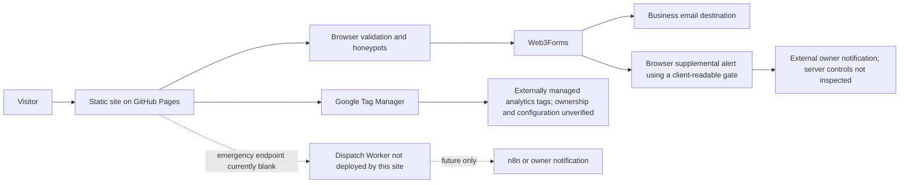
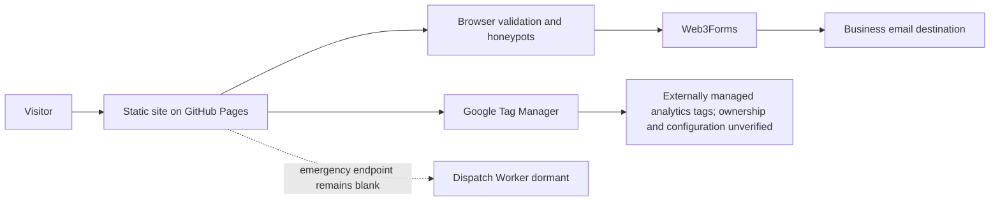

# Hernandez Landscape Website Audit and Improvement Handoff

Audit date: July 9, 2026

Business: Hernandez Landscape & Tree Service LLC

Production site: <https://hernandezlandscapeservices.com>

Production source snapshot reviewed: `dc9ab9a`

Local status: improvements are implemented and tested in the working tree, but are **not deployed**

This document separates live production evidence from local, pending changes. It does not expose private credentials or customer data. No real quote, emergency, email, CRM, or notification submission was sent.

## 1. Executive assessment

The production site is fundamentally healthy: it is crawlable, HTTPS is enforced, the public route and asset inventory returned successfully, canonical and hreflang markup are coherent, and the site has real service, gallery, video, service-area, legal, and quote-request surfaces. The current static architecture is appropriate for a small local service business and does not need a framework migration.

The largest observed weaknesses were trust and reliability details around that healthy core: a fixed mobile call bar obscured important content at several short/small viewports; many secondary routes lacked mobile navigation; the browser exposed a bearer-like gate used by a supplemental owner-alert integration; content heuristics could silently discard legitimate leads; Spanish coverage was incomplete; the video page eagerly exposed dozens of poster requests; form failure handling lacked a timeout and strong recovery path; and GitHub Pages does not emit modern security headers.

All scoped, high-confidence repository changes described in this handoff are implemented locally. They add responsive call-bar behavior, consistent mobile navigation, clearer conversion copy, Spanish translations for 244 declared dictionary references, more accessible interactions, safer lead handling, deferred video posters, targeted publish guards, a fuller privacy notice, Node 22 CI, and regression coverage. The full Playwright run passed in Chromium, Firefox, and WebKit. Production remains unchanged because deployment was not authorized.

The owner should revoke the exposed supplemental-alert gate now, or coordinate revocation with the release if the alert must remain temporarily; Web3Forms is a separate primary delivery path in the deployed source. The next release should be reviewed by the business owner, deployed through the existing GitHub Pages workflow, and verified on production. Live Web3Forms delivery should be tested once with owner authorization.

## 2. Verified website facts

### Verified from production on July 9, 2026

- The site is served over HTTPS at the apex domain and identifies as GitHub Pages.
- Production is consistent with deployment `dc9ab9a`: the homepage matched `HEAD:index.html` byte-for-byte, the live service worker was stamped with that SHA, remote `main` pointed to it, and the Pages run succeeded. The local working-tree improvements are not live.
- All 24 sitemap URLs returned `200`, self-canonicalized, and had unique titles and meta descriptions.
- All 32 distinct internal page targets checked returned successfully with no broken internal links or redirect chains.
- All 120 referenced production assets checked returned successfully with appropriate content types.
- All 15 images declared in the sitemap returned successfully.
- `robots.txt`, `sitemap.xml`, canonical URLs, and the five Spanish city-route hreflang pairs were coherent in the crawl. JSON-LD parsed without syntax errors and contained the expected objects; a rich-results/schema semantic validator was not run.
- HTTP apex and both `www` schemes redirect in one hop to the canonical HTTPS apex; the canonical HTTPS apex returns `200`.
- A nonexistent URL returns a real `404` response.
- TLS 1.2 and TLS 1.3 were accepted; TLS 1.0 and 1.1 were rejected. The certificate covered apex and `www` and was observed expiring August 26, 2026.
- Authoritative DNS was served by Namecheap nameservers; the apex used GitHub Pages A records and `www` pointed to the GitHub Pages host. Account ownership/access was not verified.
- Live HTML/assets used gzip where applicable and advertised a uniform ten-minute browser cache (`max-age=600`).
- The live response did not include CSP, HSTS, `X-Content-Type-Options`, frame protection, `Referrer-Policy`, or `Permissions-Policy` headers.

### Verified from the repository

- The deployed product is a static multipage site. There is no deployed CMS, database, authentication system, admin portal, or same-origin application API in the current publish artifact.
- The primary quote form and emergency fallback submit directly to Web3Forms.
- Google Tag Manager is actively loaded by `assets/js/analytics.js`; the container's internal tags and retention settings are managed outside this repository and were not inspected.
- A Cloudflare-style emergency dispatch handler exists under `functions/`, but it is not included in the GitHub Pages artifact and the public tree-removal form has an empty `data-endpoint`.
- IndexNow submission runs after a successful GitHub Pages deployment.
- A full lockfile audit reports zero known vulnerabilities; the deployed static artifact has no npm runtime dependencies.

### Published business claims requiring owner confirmation

The site publishes the phone number, DeKalb address, business hours, “since 2019,” family-owned status, insured/licensed wording and LLC authorization number, 24/7 emergency availability, service-area minimums, and response-time expectations. The audit verified that these statements are present and consistent in code; it did not independently verify the underlying business facts.

## 3. Technology and architecture findings

| Area | Verified implementation | Notes |
| --- | --- | --- |
| Front end | Static semantic HTML, generated Tailwind CSS, small vanilla JavaScript modules | No client framework or bundler is needed for the current scope. |
| Back end | No deployed same-origin back end | `functions/emergency-dispatch.mjs` is dormant and excluded from publish. |
| CMS | None verified | Gallery/video surfaces are generated from `media/gallery.json`. |
| Hosting/deploy | GitHub Pages through GitHub Actions | Pushes to `main` build, test, prepare an allowlisted artifact, deploy, then submit IndexNow. |
| Build/package manager | npm and Tailwind 3.4; production deployment `dc9ab9a` used Node 18, while the pending local workflow uses Node 22 | `assets/css/styles.css` is generated from `src/input.css`. |
| Test system | Playwright 1.59 plus Node validation scripts | Chromium, Firefox, and WebKit are covered locally. CI installs Chromium only. |
| Form processing | Web3Forms | Public form identifiers are expected in a browser form; provider account configuration was not inspected. |
| Email/CRM/database | Not verified | No CRM or database integration is present in the deployed source. The receiving mailbox/provider is external and unknown. |
| Analytics | Google Tag Manager plus local `dataLayer` events | Call and quote CTA events contain link URLs, not form-field contents. Container contents require owner access. |
| Search integrations | Sitemap, robots, search verification files, IndexNow | Search Console/Bing account access and indexing reports were not available. |
| DNS/CDN | Namecheap authoritative DNS and GitHub Pages hosting/caching were observed | DNS account access and ownership were not verified; no configurable edge proxy is present in the repository. |
| Third parties | Web3Forms, Google Tag Manager, Google Maps, Font Awesome CDN, social/review links | CSP must account for the integrations actually retained. |
| Authentication/admin | None in current deploy | Historical Firebase uploader material exists in repository history and stale contributor instructions. |
| Logging/monitoring | GitHub Actions logs; no application error tracker or uptime monitor verified | Lead-delivery failures are shown to the visitor but are not centrally observed. |

### Live production lead data flow (`dc9ab9a`)

### Pending local release flow

The main quote path collects name, phone, optional email, property address, ownership confirmation, preferred call time, requested service, project details, and quote-starter context. The emergency form can also collect an address/ZIP and optional precise geolocation after an explicit click. Web3Forms' downstream mailbox, retention, access controls, and failure notifications could not be verified from source.

## 4. Front-end findings

### Conversion and UX

The pending local homepage answers the core first-visit questions in its first screen: the business provides tree, lawn, and landscaping services; it serves DeKalb County; it offers English/Spanish estimates; and the visitor can see a starting range or call. “See Starting Range” is deliberately distinct from “Request Free Quote,” so the quote starter no longer looks like a hidden submission.

Unsupported volume claims and guaranteed same-day wording were replaced locally with factual, lower-risk copy. The quick quote starter explicitly says it does not send anything, and the final form explains the expected response window and data use. The desktop visual hierarchy and Spanish hero were checked through Computer Use in Brave against the current local build.

The previous navigation gap across service and service-area pages is fixed locally with a shared accessible mobile menu. The fixed call bar now yields to the visible quote CTA and short landscape viewports instead of covering content. Gallery and video menus now have one event path, correct expanded/hidden state, Escape handling, outside-click handling, and focus restoration. Canonical root links replace internal `/index.html` links.

### Important page groups

| Page/group | Purpose and target intent | Current strengths | Remaining recommendation | Primary CTA and linking |
| --- | --- | --- | --- | --- |
| `/` | DeKalb County homeowner comparing landscaping/tree providers | Clear service/location headline, real work imagery, process, service areas, FAQs, bilingual UI, call and quote paths | Owner-confirm proof claims and monitor quote-start-to-submit conversion | “See Starting Range,” call, final quote; links to every core service, gallery, video, and city hub |
| `/tree-removal/` | Urgent and planned tree-removal prospects | Specific emergency intake, service explanation, local schema, fallback to Web3Forms | Confirm 24/7 staffing; harden/activate the Worker only if operationally ready | Emergency request or call; link to gallery and relevant service areas |
| `/lawn-care/`, `/landscaping-design/` | Recurring lawn care and project-based landscaping intent | Focused copy, project imagery, schema, quote links | Add only owner-approved seasonal details and project examples | Request quote; cross-link gallery and nearby service areas |
| `/snow-removal/`, `/leaf-removal/`, `/gutter-cleaning/`, `/pressure-washing/` | Secondary/seasonal add-on intent | Legitimate dedicated pages with distinct copy and metadata | Confirm availability, minimums, and scheduling language each season | Request quote; cross-link adjacent services rather than create more thin pages |
| `/service-areas/` plus six English cities | Local-intent discovery | Distinct titles/descriptions, working canonical routes, valid city navigation | Keep pages materially distinct and update only with real local proof | Quote/call; link to core services and nearby city pages |
| Five `/es/service-areas/.../` routes | Crawlable Spanish city intent | Correct hreflang pairing and Spanish content | Build Spanish home/service routes only after human review; the JS toggle is not a substitute for crawlable URLs | Spanish quote/call; link to future Spanish service pages |
| `/gallery/`, `/videos/` | Proof-of-work and trust | Production has real categorized project media; the pending local release adds accessible names and deferred video posters | Add captions/transcripts for spoken videos and continue curating strongest proof first | Quote/call; deep-link to relevant service pages |
| Legal, payment, card, and utility pages | Privacy/terms, payment outcomes, QR/card tools | Canonical/noindex rules pass the repository SEO check | Keep utility pages out of the sitemap unless they serve search intent | Return to home/contact; no new SEO landing pages |

## 5. Back-end findings

There is no conventional application back end in production, which keeps the attack surface small but makes the business dependent on external form and analytics providers. Direct Web3Forms submission is the only verified primary delivery integration in the deployed source; downstream mailbox operations were not inspected. A supplemental browser-to-owner alert duplicates lead data to an external notification path in production; that path and its client-readable bearer-like gate have been removed locally. No external service was changed, so owner-authorized revocation is still required.

The dormant emergency handler has good bounded validation, JSON-only handling, origin allowlisting, sanitization, timeout behavior, and explicit upstream failure responses. Its in-memory per-isolate rate limit is not durable enough for public activation, and the current browser fallback can duplicate an ambiguous request if a future Worker forwards successfully but the browser loses the response. It should remain dormant until an edge rate-limit/Turnstile and idempotency plan exist.

The GitHub Pages build has a clear rollback path through Git history and workflow reruns, but there is no documented one-command production rollback or preview environment. The publish step now applies a targeted denylist and targeted text-pattern guard for known server-secret/config risks; it is not a comprehensive secret scanner.

## 6. Security findings

### Improved locally

- Removed the client-side owner-alert webhook call and browser-visible gate value.
- Added publish-artifact rejection for Firebase config, service-account files, `.env` variants, private keys, logs, and source maps.
- Added a targeted published-text guard for private-key blocks and selected server-only credential assignments.
- Upgraded CI from end-of-life Node 18 to Node 22 and declared the runtime requirement.
- Expanded privacy disclosure for Web3Forms, Google/GTM, optional location, and contact/property data.
- Confirmed a full `npm audit` reports zero vulnerabilities; the deployed static artifact has no npm runtime dependencies.

### Still open

- Production still contains the removed alert integration until an authorized deploy. Its browser-visible gate cannot be treated as secret; abuse impact depends on uninspected server enforcement. Revoke it now with owner authorization, or coordinate revocation with the release, because deleting it from the current file does not remove cached or historical copies.
- GitHub Pages does not provide repository-configurable security headers. A proxy/CDN is needed for CSP, HSTS, nosniff, frame, referrer, and permissions policies.
- CSP should begin in Report-Only mode. The current site uses Google Tag Manager, Web3Forms, Google Maps, Font Awesome, QR/card resources, and inline code, so a generic restrictive policy would break production.
- Historical Firebase web config and a phone allowlist exist in git history. The owner must confirm whether the Firebase project is active; active services need referrer/API restrictions plus server-enforced Auth/Storage rules, while retired services should be disabled.
- Third-party assets and GitHub Actions can be hardened further by self-hosting/using integrity metadata where practical and pinning Actions to reviewed commit SHAs.
- Add a maintained secret-detection tool in CI; the new publish guard intentionally covers only selected high-risk filenames and patterns.

No intrusive scanning, credential use, authentication bypass, or destructive security testing was performed.

## 7. Form and lead-delivery findings

### Main quote form, local implementation

- Native required fields and bounded lengths are present; phone/email validation, labels, autocomplete, and ownership confirmation are explicit.
- High-confidence honeypots are silently discarded without consuming Web3Forms quota.
- Softer timing/content signals are tagged as `[Possible Spam]` and still delivered instead of receiving a fake success.
- The browser enforces a 12-second request timeout, checks HTTP and JSON success, exposes busy state, preserves entered data after failure, restores the submit button, and gives a tappable call fallback.
- The emergency Web3Forms fallback now also bounds fields, enforces a 12-second timeout, handles non-JSON/provider failures honestly, preserves entered data, restores busy state, and shows a call fallback.
- The starter only pre-fills the final form and does not submit a lead.
- Automated tests mock Web3Forms; no real lead was sent.

### Remaining delivery limits

- Browser validation can be bypassed because Web3Forms is a public endpoint. Provider-side abuse controls or a hardened proxy are needed to protect quota.
- The receiving inbox, forwarding rules, spam placement, customer confirmation email, retention, and provider failure alerts were not available for inspection.
- There is no verified CRM, lead database, durable retry queue, idempotency key, or centralized lead-failure log.
- The dormant Worker-to-Web3Forms fallback still lacks durable idempotency; an ambiguous lost Worker response could produce a duplicate if that branch is activated.
- A single authorized production submission is still required to verify end-to-end delivery and the visitor-facing success state.

## 8. SEO findings

Production technical SEO is strong for a small static site: the crawl found no broken sitemap route, duplicate title/description, canonical mismatch, malformed hreflang pair, asset failure, or false `200` error page. Structured data, robots, sitemap, Open Graph metadata, mobile rendering, HTTPS, and redirects are present.

Local changes remove internal `/index.html` variants, update sitemap dates for generated routes, preserve canonical directory URLs, and add a translation completeness guard. The site should not create more city pages unless there is real service coverage and distinct local value.

The main open SEO opportunity is crawlable Spanish coverage. The client-side language toggle helps users but does not create an indexable Spanish homepage or Spanish service URLs. Only five city routes currently have Spanish counterparts. Human-reviewed Spanish home and highest-value service pages should come before expanding to more cities.

The featured review currently links to a third-party listing rather than a direct Google review/profile source. The owner should provide the authoritative review URL and confirm permission/accuracy before it is used as a stronger trust signal. Search Console, Google Business Profile, Bing Webmaster/IndexNow reports, rankings, calls, and organic conversion data require account access and were not audited.

## 9. Accessibility findings

Local changes add or improve skip links, main landmarks, mobile menu semantics, 44-pixel targets, Escape/outside-click behavior, focus restoration, form labels and error state, a labeled call fallback, FAQ headings, video labels, slider keyboard controls, value text/instructions, touch/keyboard-accessible gallery captions, and reduced-motion behavior. They also fix a production call-bar collision that covered the quote CTA/content at 320×568, 360×640, 390/414-pixel phones, and 640×360 landscape.

The 19-route mobile navigation matrix and keyboard interactions are covered by Playwright. Computer Use confirmed the desktop English and Spanish UI against the current build. The audit did not replace a human screen-reader or low-vision review, and color contrast was not measured with a dedicated instrumentation tool. A release candidate should receive a short VoiceOver/TalkBack pass covering navigation, the starter, final quote form, FAQ, gallery, and video controls.

Video captions/transcripts were not verified. Any video containing meaningful speech needs synchronized captions; silent project footage still needs a useful adjacent title/description.

## 10. Performance findings

### Measured locally

- Media manifest: 60 items validated.
- Homepage gallery images: 4.7 MB against a 5 MB repository budget.
- Gallery-page images: 6.5 MB against a 7 MB budget.
- Referenced video files: 326.2 MB against a 350 MB repository budget.
- The pending video page has three direct posters; 33 `data-poster` values hydrate within a 600-pixel observer margin. This reduces initial requests, while a full scroll can still load every poster.
- All 36 videos request `preload="none"`; actual MP4 network behavior was not traced with Chrome DevTools.
- Service hero images now have intrinsic dimensions, async decoding, and high-priority LCP hints where applicable.
- The publish layout sweep passed 29 routes at 320, 390, 768, and 1440 pixels with no disallowed initial-viewport escape/overflow under its tolerances, no broken visible images, and no bad responses. It does not scroll through each page.

### Not measured

No numeric LCP, CLS, INP, FCP, TBT, Speed Index, or Lighthouse score is claimed. The web-performance skill requires a Chrome DevTools MCP server, which was not configured in this environment. A cold-cache production trace should be run after deployment; field data from Search Console/CrUX should be preferred once available.

Remaining performance priorities cannot be ranked confidently without a trace. Candidate work includes self-hosting or integrity-pinning Font Awesome, removing obsolete preconnects only after a network trace confirms they are unused, and evaluating service-worker/cache behavior on the production release rather than changing it speculatively.

## 11. Prioritized issue table

### Immediate fixes

| Priority | Surface | Status | Finding | Evidence | Risk or business impact | Recommended fix | Effort | Dependencies / owner | Validation method |
| --- | --- | --- | --- | --- | --- | --- | --- | --- | --- |
| High | Back end / security | Removed locally; still live | Client-readable bearer-like gate on the supplemental alert path | Production JavaScript exposes the gate and notification request; server enforcement was not available for inspection | Gate cannot be treated as secret; potential forged-alert/noise impact depends on external enforcement | Revoke now with owner authorization, or coordinate revocation with deployment; deploy the local removal | S | External-service owner and release owner | Inspect production bundle and provider configuration; confirm old gate is rejected without sending a real alert |
| High | Front end / accessibility | Fixed locally; not live | Fixed mobile call CTA covers the estimate CTA or content | Production-equivalent measurements found overlap at 320×568, 360×640, 390/414-pixel phones, and 640×360 landscape | Obscured conversion controls/content and blocked tap targets | Deploy the observer/short-landscape behavior already implemented | S | Release owner | Visual/interaction checks at each affected viewport plus the layout suite |
| High | Front end | Fixed locally; not live | Mobile navigation missing on 19 service/service-area routes | Route matrix showed no usable small-screen menu | Visitors cannot reliably compare services or reach a quote from secondary pages | Deploy the shared accessible menu already implemented | S | Release owner | Test all 19 routes at 320/390 px and by keyboard |
| High | Back end / lead delivery | Fixed locally; not live | Non-honeypot content/timing heuristics could silently lose legitimate leads | Stacked phrase/link scores received fake success with no provider request | Lost revenue with no owner or visitor signal | Deploy honeypot-only hard blocking and `[Possible Spam]` review tagging | S | Release owner; provider quota should be monitored | Mock autofill and stacked-signal variants; run one authorized live sample |
| High | Back end / operations | Pending | End-to-end Web3Forms delivery is unverified | Tests intentionally mock the provider; no real submission was authorized | A provider/mailbox configuration issue could still lose leads | Authorize one labeled production test and verify inbox, spam, timestamp, reply path, and analytics | S | Business owner and mailbox administrator | Trace one test from submit through received email and response |
| High | Front end / trust | Owner confirmation required | Published business claims are not independently verified | Site states licensing/insurance, 24/7 emergency, hours, history, response time, and minimums | Incorrect claims can reduce trust or create legal/operational mismatch | Confirm each statement in writing and update any mismatch before deployment | S | Business owner | Signed content checklist and production copy review |
| Medium | Front end / accessibility | Fixed locally; not live | Comparison/gallery interactions were not fully keyboard/touch discoverable | Slider behavior and hover-only captions lacked equivalent keyboard/touch affordances | Project proof was harder to use for keyboard, touch, and reduced-motion users | Deploy keyboard slider instructions/value text and accessible caption behavior already implemented | S | Release owner | Keyboard, touch, reduced-motion, and screen-reader smoke tests |

### High-impact improvements

| Priority | Surface | Status | Finding | Evidence | Risk or business impact | Recommended fix | Effort | Dependencies / owner | Validation method |
| --- | --- | --- | --- | --- | --- | --- | --- | --- | --- |
| High | Back end / security | Pending infrastructure | No modern response security headers | Live responses lack CSP/HSTS/nosniff/frame/referrer/permissions headers | Larger impact from injection/content-type/framing issues and weaker browser privacy controls | Put the site behind a configurable edge proxy; stage CSP Report-Only, then HSTS and remaining headers | M | DNS/CDN administrator and integration inventory | Header scan, CSP report review, form/map/analytics regression suite |
| High | SEO / front end | Pending content | Crawlable Spanish coverage is limited to five city routes | Homepage/service translation is JS-only | Missed Spanish search demand and inconsistent organic landing experience | Create human-reviewed Spanish home and top-service routes with self-canonical/hreflang pairs | L | Native reviewer, business owner, SEO maintainer | SEO checks, crawl, human language review, Search Console indexing |
| Medium | Front end / SEO | Owner input required | Featured review source is indirect | CTA points to a third-party listing rather than an owner-provided primary profile/review | Weaker proof and possible attribution drift | Replace only after the owner supplies the direct authoritative URL and confirms the quotation | S | Business owner / Google profile administrator | Link check and source-text comparison |
| Medium | Privacy / analytics | Pending account audit | GTM container contents and consent/retention are unverified | Repository loads an active container; external tags are not in source | Undisclosed tracking, noisy analytics, or accidental PII capture | Audit container tags and retention, block form-field capture, and add consent if legally/operationally required | M | GTM administrator and privacy owner | Tag Assistant/network review and privacy-policy comparison |
| Medium | SEO / routing | Fixed locally; not live | Ten live pages link internally to `/index.html` | Duplicate URL returns `200` but canonicalizes to `/` | Wasted crawl signals and avoidable URL inconsistency | Deploy canonical root links already implemented | S | Release owner | Crawl source links; confirm no internal `index.html` href remains |

### Medium-term improvements

| Priority | Surface | Status | Finding | Evidence | Risk or business impact | Recommended fix | Effort | Dependencies / owner | Validation method |
| --- | --- | --- | --- | --- | --- | --- | --- | --- | --- |
| Medium | Back end | Dormant; do not activate yet | Emergency Worker lacks durable abuse and duplicate controls | Empty public endpoint, in-memory per-isolate rate limit, and ambiguous-response fallback | Abuse, duplicate pages, or false confidence if activated prematurely | Keep dormant; add edge rate limiting, Turnstile, trusted IP handling, and an idempotency key before activation | M | Worker/CDN/n8n administrator and paging-process owner | Staging load/abuse tests with stubbed n8n; failure and duplicate tests |
| Medium | Accessibility / content | Pending media review | Video captions/transcripts are unverified | 36 videos have localized control labels, but speech content was not reviewed | Deaf/hard-of-hearing users may miss information | Inventory spoken content; add VTT captions/transcripts and concise adjacent descriptions | M | Media owner / transcription reviewer | Caption track checks and keyboard/screen-reader pass |
| Medium | Back end / reliability | Pending operational decision | No centralized lead monitoring, durable retry, or CRM record | Direct browser-to-Web3Forms flow; no repository logging/CRM | Delivery failures may be discovered only after a customer complains | Add provider alerts first; consider a provider-originated webhook or hardened primary edge intake only when operations can own it | M-L | Provider/CRM owner and privacy policy | Synthetic staging lead, failure alert, duplicate and retry tests |
| Medium | Performance | Instrumentation unavailable | Core Web Vitals are unmeasured | Chrome DevTools MCP and field analytics were unavailable | Remaining runtime bottlenecks cannot be prioritized quantitatively | Run a cold-cache production trace and review CrUX/Search Console after release | S | Performance owner and Chrome DevTools/PageSpeed/Search Console access | Record LCP/CLS/INP/FCP/TBT and named trace culprits |
| Medium | Front end / resilience | Known limitation | Twelve service/service-area routes inject mobile navigation/skip links with JavaScript | Playwright covers the JS-enabled path; disabling/failing JS removes those affordances | Navigation accessibility degrades if the script fails | Render the generated navigation/skip markup statically, retaining JS only for behavior | M | Page generator owner | JS-disabled route matrix plus existing keyboard tests |

### Long-term improvements

| Priority | Surface | Status | Finding | Evidence | Risk or business impact | Recommended fix | Effort | Dependencies / owner | Validation method |
| --- | --- | --- | --- | --- | --- | --- | --- | --- | --- |
| Medium | Security / maintenance | Owner decision required | Historical Firebase uploader configuration may be stale or active | Current deploy has no admin, but config/allowlist exists in history and contributor notes | Accidental reactivation or inadequately restricted legacy service | Confirm retirement; disable unused services or audit rules/restrictions; update contributor guidance | M | Firebase administrator | Firebase console/rules review and publish artifact scan |
| Low | Supply chain | Pending | Some runtime third-party assets and Actions remain mutable | Font Awesome CDN and major-version Action tags | Third-party availability/integrity and build drift | Self-host/integrity-pin assets where useful; pin Actions to reviewed SHAs | M | Repository maintainer | Offline/static asset test and reproducible CI run |
| Medium | Operations | Pending | Rollback, uptime, and backup ownership are implicit | Git history and Pages rerun exist, but no monitor/rollback runbook was verified | Longer detection and recovery time | Document rollback; add uptime checks for home, form page, sitemap, and 404; export external configs periodically | M | GitHub/provider administrators | Quarterly recovery drill and alert delivery test |
| Low | Performance / caching | Pending measured review | All live asset classes advertise the same ten-minute cache lifetime | Live headers show `max-age=600` even for immutable media | Repeat visitors may redownload unchanged assets; changing policy without versioned URLs risks staleness | Measure first, then use fingerprinted/versioned assets before adopting longer immutable caching | M | Hosting/CDN owner and asset-versioning plan | Network trace, repeat-view transfer comparison, rollback test |

Effort: S = hours, M = roughly one to three working days, L = multi-day/content-and-platform effort.

## 12. Recommended front-end changes

All scoped, high-confidence front-end changes described here are implemented locally. Before release, the owner should review all proof/availability/pricing claims and the Spanish terminology. After release, the next front-end work should be limited to evidence-backed items:

1. Add a direct, authoritative review/profile link and only owner-approved review quotations.
2. Create crawlable Spanish home and top-service routes with a native-language review; do not mass-generate thin city pages.
3. Add captions/transcripts where videos contain speech and replace generic video names with owner-reviewed project descriptions when available.
4. Render the generated mobile navigation/skip-link markup statically on the 12 routes that currently depend on JavaScript injection.
5. Run a short human assistive-technology pass and correct any observed focus/announcement issues.
6. Use analytics to compare call clicks, quote starts, validation failures, and completed requests before restructuring the two-step quote flow.

## 13. Recommended back-end changes

1. Keep Web3Forms as the primary delivery path until a replacement has a clear operational owner.
2. Perform one owner-authorized live delivery test and enable provider-side failure/spam alerts.
3. Revoke the browser-visible alert gate now with owner authorization, or coordinate revocation with deployment; do not restore a secret to browser code.
4. If supplemental notifications are still needed, trigger them from a provider-originated webhook or let a hardened edge handler own primary submission and alerting. Keep server-side secrets, bounded validation, durable rate limiting, Turnstile, timeout, idempotency, failure logging, and a direct Web3Forms fallback.
5. Introduce security headers through a configurable edge proxy, beginning with CSP Report-Only.
6. Audit the GTM container for PII, tags, consent behavior, and retention.
7. Confirm whether the historical Firebase project is active and retire or secure it accordingly.
8. Document rollback and add lightweight uptime/lead-delivery monitoring.

## 14. Changes implemented, if authorized

Repository edits were authorized by the request; production deployment was not.

### Files and behavior changed

- Homepage and shared UI: `index.html`, service/service-area HTML, gallery/video HTML, legal/payment pages, `assets/css/*`, generated Tailwind output, and service worker cache entries.
- Interaction modules: `assets/js/main.js`, `i18n.js`, `service-nav.js`, `video-gallery.js`, gallery modules, mobile call CTA, and analytics documentation.
- Content/media source: `media/gallery.json`, generated media surfaces, sitemap dates, and the local page generator.
- Build/security: `package.json`, lockfile, deploy workflow, publish preparation, emergency handler documentation/tests, and the lead-alert runbook.
- QA: new i18n validation and quality-regression Playwright coverage; updated quote/gallery tests.

### Front-end behavior

- Consistent mobile navigation and skip/main landmarks across secondary routes.
- Clearer hero, quote-starter, response-time, trust, and CTA copy without unsupported volume/guarantee claims.
- Spanish translations for all 244 declared dictionary references, including menu/slider/video accessible labels. The guard does not prove that every unkeyed sentence or image alt is bilingual.
- Accessible gallery/video menus, labeled controls, deferred video posters, keyboard slider controls, and reduced-motion support.
- Better main and emergency form labels, bounds, invalid/busy state, timeout/failure recovery, and tappable call fallback.

### Back-end/build behavior

- Main browser lead delivery now has timeout, response validation, and honest spam handling.
- Supplemental browser webhook delivery is removed; Web3Forms remains the single active lead path.
- Publish preparation rejects selected sensitive/development artifacts and applies a targeted runtime text-pattern guard before upload.
- CI uses Node 22 and runs the expanded validation chain.

### Security and data-flow implications

- Lead PII is no longer duplicated from the browser to the supplemental owner-alert webhook in the local build.
- No new server, database, credential, analytics tag, or external processor was added.
- The privacy notice now describes the active and optional data flows more accurately.
- The removed browser-visible alert gate still requires provider-side revocation and remains exposed in production until that action and deployment are complete.

### Assumptions and limitations

- Published business claims were preserved or softened, not independently certified.
- Web3Forms, GTM, GitHub, DNS, mailbox, n8n, Firebase, and Google Business/Search account settings were not changed.
- The emergency Worker remains dormant.
- No production deployment, live form request, or external notification occurred.

## 15. Tests performed and results

| Status | Test | Result |
| --- | --- | --- |
| Passed | Production crawl | 24 sitemap URLs, 32 internal targets, 120 assets, and 15 sitemap images healthy |
| Passed | `npm run build` | Tailwind production CSS generated; only the existing stale Browserslist data warning appeared |
| Passed | `npm run media:check` | 60 media items and generated surfaces in sync |
| Passed | `npm run media:budget` | 4.7/5 MB home gallery, 6.5/7 MB gallery, 326.2/350 MB videos |
| Passed | `npm run i18n:check` | 244 declared HTML/JavaScript dictionary references have Spanish translations; unkeyed copy/alt text is outside this guard |
| Passed | `npm run seo:check` | SEO rules pass; one documented owner-pending review-link placeholder remains |
| Passed | `npm run nap:check` | NAP rules pass; two documented owner-pending pricing-phone warnings remain |
| Passed | `npm run test:dispatch` | 15/15 handler tests with a stubbed upstream; no live webhook call |
| Passed | `npm run publish:prepare` | 66 runtime files and 97 referenced media files; targeted forbidden-file/text-pattern guard passed |
| Passed | `npm run publish:check-layout` | 29 routes × 4 viewports; no disallowed initial-viewport escape/overflow, broken visible images, or bad responses under the sweep's tolerances |
| Passed | Full Playwright suite | 244 passed, 2 intentionally skipped, exit 0 across Chromium, Firefox, and WebKit |
| Passed | Computer Use desktop check | Current English and Spanish homepages rendered with correct hierarchy, CTA copy, and translated navigation/hero |
| Passed | Full `npm audit` | Zero known vulnerabilities in the lockfile; deployed static artifact has no npm runtime dependencies |
| Not run | Real Web3Forms/email/CRM delivery | Explicitly avoided to protect the business from an unsolicited test lead |
| Not run | Core Web Vitals/Lighthouse trace | Required Chrome DevTools MCP was unavailable; no metric is fabricated |
| Not run | Production verification of local changes | No deployment authorization |
| Owner required | Business claims, direct review source, pricing/minimums, GTM policy, Firebase status | Cannot be established from code alone |

The two Playwright skips are deliberate non-Chromium duplicates of the visual matrix, not failing coverage.

## 16. Missing access or business information

- Written confirmation of licensing/insurance wording and whether the published authorization number is the preferred public identifier.
- Confirmation that 24/7 emergency wording reflects real staffing and response expectations.
- Current services, seasonal availability, business hours, response-time promise, travel minimums, and any pricing language the owner approves.
- Direct Google Business Profile/review URL and permission to quote the selected review.
- Web3Forms account/inbox access, recipient address, spam rules, confirmation-email settings, retention, and failure alerts.
- GTM/analytics admin access, tag inventory, consent decision, and retention settings.
- Search Console, Bing Webmaster/IndexNow reporting, and Google Business Profile performance access.
- DNS provider access and permission to add a configurable edge proxy/security headers.
- Confirmation that the historical Firebase uploader/project is retired or details for a rules/restrictions audit.
- n8n/Worker account access and an operational decision on whether emergency paging should ever be activated.
- A native Spanish reviewer and the desired set of crawlable Spanish service URLs.
- Deployment authorization and an approved production verification window.

## 17. Remaining risks

- The live site remains on the old bundle until deployment, including the client-readable alert gate and missing local UX/accessibility fixes.
- Provider-side revocation is required even after the alert code is removed.
- Web3Forms delivery can still fail downstream in ways the repository cannot observe.
- GitHub Pages security headers cannot be completed in repository code alone.
- The emergency Worker is not production-ready for public activation without durable abuse controls and idempotency.
- GTM container behavior and consent/retention remain unknown.
- Spanish organic coverage is incomplete even though the user-facing toggle is much better.
- Video speech/caption coverage, human screen-reader behavior, and measured Core Web Vitals remain unverified.
- Historical Firebase configuration and contributor guidance may cause confusion until the owner decides its status.
- No production deployment, post-deploy crawl, real lead test, or rollback drill was performed.

## 18. Recommended maintenance plan

### Every release

1. Run `npm ci`, `npm run build`, `npm run test:ci`, `npm run publish:prepare`, and `npm run publish:check-layout`.
2. Review the publish artifact for unexpected files, run maintained secret detection, and verify that no server-side provider secrets were added to browser code. Public form identifiers are expected in client markup.
3. Use a preview/local build to check English and Spanish at 320, 390, 768, and desktop widths.
4. Deploy only with approval, then verify home, core service pages, gallery, videos, forms without submitting, sitemap, robots, redirects, 404, and security headers.
5. If form behavior changed, send one explicitly authorized labeled test and confirm receipt.

### Monthly

- Check uptime, GitHub Actions failures, Search Console coverage, Web3Forms quota/delivery alerts, broken links/assets, and Google Business Profile consistency.
- Review call/quote events for anomalies without collecting form-field PII.
- Curate new project media through `media/gallery.json`, then rerun media generation and budgets.

### Quarterly

- Run dependency updates and `npm audit`, a cold-cache Core Web Vitals trace, keyboard/screen-reader smoke tests, and a content-claims review with the owner.
- Review GTM tags/retention, external processors, privacy notice, access lists, and inactive integrations.
- Test the documented rollback path and restore/export procedures for externally managed configuration.

### Annually or after infrastructure changes

- Revalidate DNS/TLS, security headers/CSP, Firebase retirement or restrictions, Worker/n8n abuse controls, business licensing/insurance wording, service areas, hours, and emergency availability.
- Remove stale pages/integrations instead of leaving dormant systems ambiguous.
